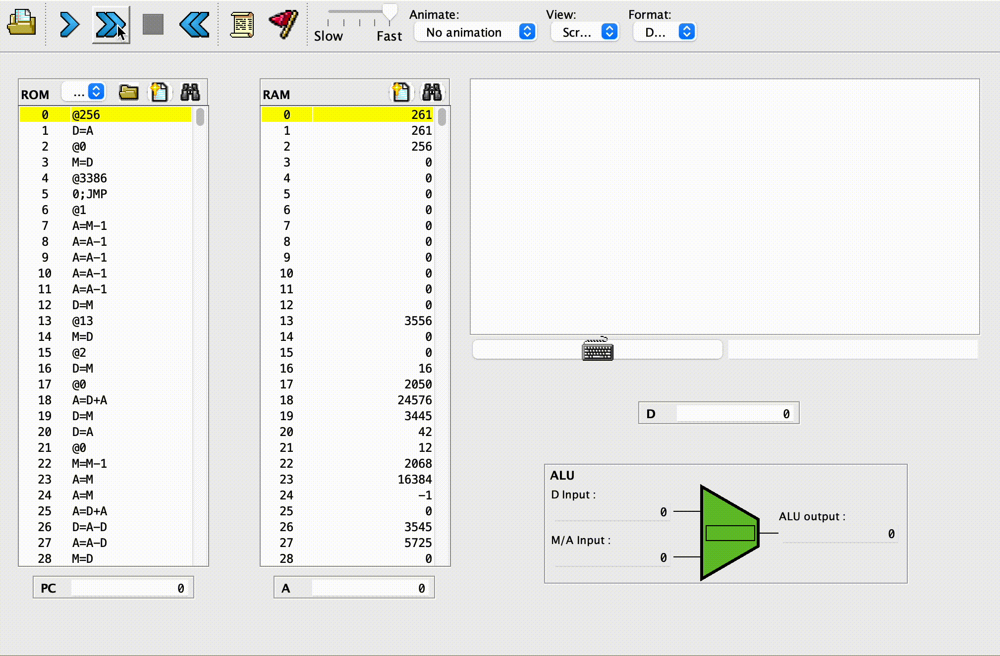

This repository consists of code written for projects that are part of [nand2tetris](https://nand2tetris.org).

## Background
nand2tetris is a project based course that aims to give a picture of the forest that is computer science by starting from basic NAND gates and building - in a number of projects - the building blocks of digital hardware, CPU, Memory and finally a working computer called HACK.

In the second half of the course, it switches over to software side of things. An assembler for the HACK instruction set, a VM translator and then a compiler for a high-level language called JACK is built. A game of choice (not necessarily tetris) and the OS for the HACK computer is the final step.  

I learnt of nand2tetris from a friend of mine in a discussion about courses that give a hollistic picture of Computer Science. I looked it up and ended up watching the [TED talk](https://youtu.be/iE7YRHxwoDs?si=HN5SScPUMfNhBPXv) by one of the creators of the course. The talk greatly resonated with me and I decided to try the projects.

## Repository organization

The `parts` directory contains the various sub-projects of the nand2tetris project. There are 12 sub-projects in total. Each of these is implemented in the numbered directories `01/` .. `12/`  found in the `parts` directory.

The `whole` directory contains code copied over from `parts` to combine the different sub-projects into a single project. This is work in progress. The main challenge is in getting the code to fit in the ROM and to get reasonable performance. Additionally, we may have to drop the first few projects and use a CPU emulator as opposed to using our own CPU built out of smaller hardware components.

The directory `tools/` contains various tools such as emulators, compilers etc. These were supplied as course material. There is also [this online ide](https://nand2tetris.github.io/web-ide/chip) which can be used instead of the offline tools.

## My experience

For the first half of the course that deals with hardware, I found the content to be similar to that covered in the book 'But how do it know?'. Refering ocassionally to the slides for things such as the instruction set architecture and such was sufficient. It was mostly smooth sailing and if you have had some exposure to gates and digital electronics, this part will not pose any roadblocks.

The second half of the course needed more careful reading of the slides as I had little experience with the compiler front end, VM translation and such. I definitely think the second part is more challenging than the first. A bonus is that, the second half of the project is amenable to pipelining the various sub-projects to form a cohesive tool which can then be verified.

I did not watch the course videos or refer to the course book - 'Elements of computing systems' - while working on the projects. Although, I might end up buying the book someday.

## Demo

Having completed the 12 parts of the project, I set out to integrate them into a single pipeline. The task of integrating various parts of the project into a single pipeline was not straight forward because when the game that I had written in high-level code was used to generate the machine code, the program wouldn't fit in HACK computer's ROM. What followed was applying a number of optimizations to the VM translator.

Here is the final result of creating the various tools and creating the pipeline:

Game code + OS (more like standard library) ---{compiler}---> VM code ---{translator}---> Assembly code ---{Assembler}--> Machine code

